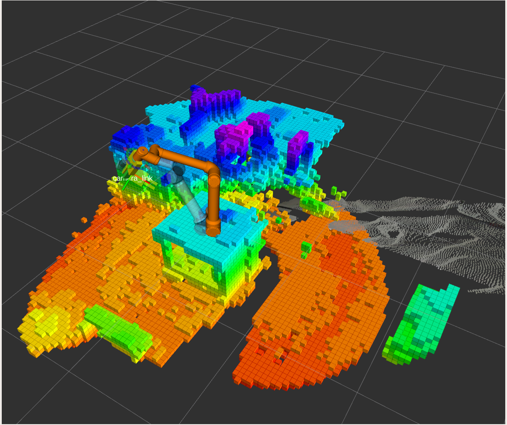

# Introduction 
## This repository is for automatic gripping planning using Robot's own perception. 

<center></center>

In this project, The serial manipulator is equipped with parallel two-finger gripper and depth camera on the end-effector link. The task is to scan the surrounding building a point-cloud map to define collision-free workspace. 

Using MoveIt, gripping planning pipeline is implemented to grasp and place detected objects. 

**TO BE IMPLEMENTED:** Using vision module from camera, object detection and recognition and optimal grasping posture will be implemented.

**Robot Hardware :**  UR10e \
**Depth camera module :** Intel Realsense D435 \
**Depth map:** Octomap

---
# Getting Started

This pipeline is built and tested on **ROS Melodic** other versions are not tested but theoritically, it should work properly\.

### Make sure you have dependencies satisfied: 

* **ROS**:  
Follow this [link](http://wiki.ros.org/melodic/Installation/Ubuntu) to install ROS

* **Catkin**:  
Install [here](http://wiki.ros.org/catkin/)

* **MoveIt:**  
```bash
sudo apt install ros-$ROS_DISTRO-moveit
```
* **Intel Realsense ROS Package :**
```bash
sudo apt-get install ros-$ROS_DISTRO-realsense2-camera
```

* **Octomap :**
```bash
sudo apt-get install ros-$ROS_DISTRO-octomap*
```
or follow instructions [here](https://wiki.ros.org/octomap)


### To use simulation make sure to install Gazebo: 
Instructions to install gazebo [here](http://gazebosim.org/tutorials?cat=guided_b&tut=guided_b1)

> **Note :** Depth camera module is not yet implemented for simulation on gazebo. Only moveit pipeline for motion planning. 

---

# Build and Test

1. Create Catkin workspace  or got to src/ forlder in your workspace.\
- To create [catkin](http://wiki.ros.org/catkin/Tutorials/create_a_workspace) work space: \
source enviroment: 
```bash
source /opt/ros/noetic/setup.bash
```
- create catkin ws:
```bash
mkdir -p ~/catkin_ws/src
cd ~/catkin_ws/
catkin_make
```
- source environment: 
```bash
source devel/setup.bash
```

2. Clone the repository into your local machine: 
```bash
git clone $link_to_repo .
```

3. If you will use hardware, make sure to follow instalation instructions of UR10e Robot Ros Driver written in package's own [README](dependencies/Universal_Robots_ROS_Driver/README.md) file\.

4. make sure to install URCap on UR robot controller\.
    - If your're using r-series robot go to this [tutorial](https://github.com/UniversalRobots/Universal_Robots_ROS_Driver/blob/master/ur_robot_driver/doc/install_urcap_e_series.md)
    - If you're using different series, go to this [tutorial](https://github.com/UniversalRobots/Universal_Robots_ROS_Driver/blob/master/ur_robot_driver/doc/install_urcap_cb3.md)

# Usage

### To launch whole program: 
* connect to the robot using ethernet cable
* connect realsense camera (if you have one)
* source your ws: 
```bash
cd catkin_ws/
```
* launch program 
```bash 
roslaunch ur_configuration launch_prog.launch robot_ip:="$robot_IP" use_camera:="true" 
```
* if you don't have camera set parameter "use_camera" to false\.
* you can also create a launch file and pass all the arguments you want to the program launch file:
```bash
ur_configuration/launch/launch_prog.launch
```

* If you want to use only simulation of Gazebo with Moveit: 
```bash
roslaunch ur_configuration sim_launch.launch
```

**To know how to use each package, Read its own documentation for details**
# Contribute
TODO: Explain how other users and developers can contribute to make your code better. 

If you want to learn more about creating good readme files then refer the following [guidelines](https://docs.microsoft.com/en-us/azure/devops/repos/git/create-a-readme?view=azure-devops). You can also seek inspiration from the below readme files:
- [ASP.NET Core](https://github.com/aspnet/Home)
- [Visual Studio Code](https://github.com/Microsoft/vscode)
- [Chakra Core](https://github.com/Microsoft/ChakraCore)